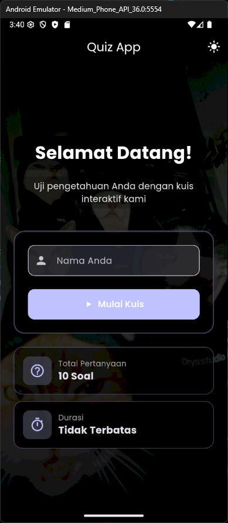
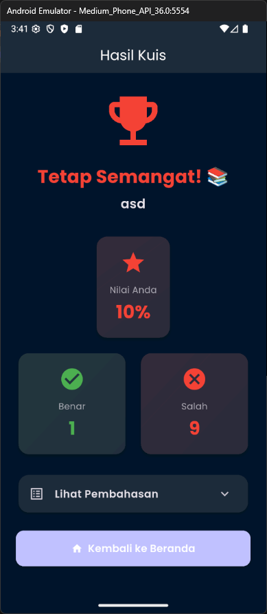

# 🧠 Quiz App

## 👤 Identitas
- **Nama:** Muhammad Sulthan Zaki Nasution 
- **NIM:** 231401008
- **Lab:** Laboratorium Pemrograman Mobile 3

---

## 📱 Nama Aplikasi
**Quiz App — Aplikasi Kuis Pilihan Ganda**

---

## 🧾 Deskripsi Aplikasi
**Quiz App** adalah aplikasi kuis interaktif berbasis **Flutter** yang memungkinkan pengguna untuk:
- Menjawab 10 pertanyaan pilihan ganda,
- Mendapatkan skor akhir,
- Melihat pembahasan setiap soal,
- Menggunakan mode **terang (Light Mode)** dan **gelap (Dark Mode)**.

Aplikasi ini dikembangkan dengan menggunakan **state management Provider**, memiliki tampilan **responsive**, dan desain yang **modern**.

---

## 💡 Credit Aset
Aset dan referensi yang digunakan dalam pengembangan aplikasi ini:
- **Ikon & Ilustrasi:** [Flaticon](https://www.flaticon.com/)  
- **Font:** [Poppins - Google Fonts](https://fonts.google.com/specimen/Poppins)  
- **Inspirasi UI:** [Dribbble Flutter Quiz UI](https://dribbble.com/search/flutter-quiz)  

---

## 🖼️ Screenshot Aplikasi

| Home Screen | Quiz Screen | Result Screen |
|:------------:|:------------:|:--------------:|
|  |  |  |

---

## 🎨 Link Mockup / Prototype
[📱 Figma Prototype - Quiz App](https://www.figma.com/design/FWkXImaNJuAmNEpvBZroH8/Mock-up-uts?node-id=0-1&t=Qas0TUDwqmlEgoe3-1)

---

## 🧱 Tech Stack
- Flutter
- Provider (State Management)
- Material Design Components

---

## 📜 Lisensi
Proyek ini dibuat untuk keperluan pembelajaran di **Lab Pemrograman Mobile 3** dan boleh digunakan untuk tujuan edukatif.
